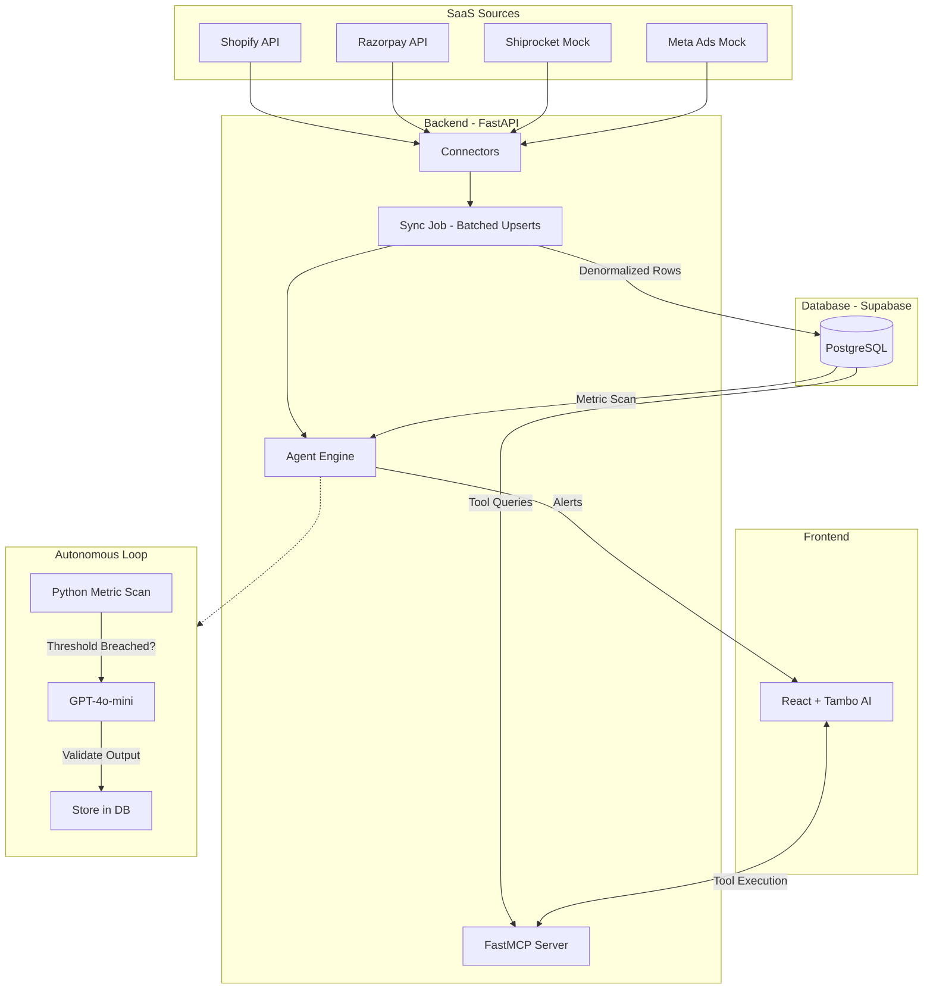
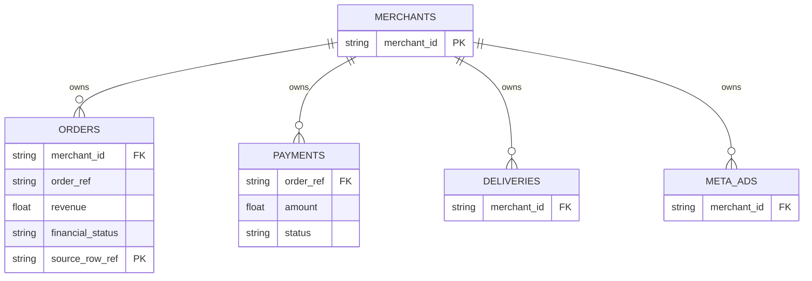

# D2C AI Employee

Most D2C founders I've talked to are running their business on vibes and stitched-together Excel sheets. They know something's leaking margin — they just can't tell if it's the courier, the payment gateway, or the ad spend.

This project is an attempt to fix that. It's a single agent that watches Shopify (orders), Razorpay (payments), Shiprocket (logistics), and Meta Ads (marketing) simultaneously, and flags issues like high RTO rates in specific courier zones or uncollected payment gaps — with the actual row-level data to back it up.

***

## Demo Video

https://github.com/user-attachments/assets/5f4e8763-3d4f-414b-84a0-574d301249f3

***

## 1. Architecture & Design

I wanted something robust enough to handle the core D2C data loop but lightweight enough to run autonomously without blowing up LLM costs.

***

## 2. Connectors: Which 3 and Why?

The requirement asked for at least 3 connectors. I chose 4 because D2C margins are lost in the gaps *between* systems.

**The Real Integrations:**
1. **Shopify:** The absolute source of truth for what was sold. (Real REST API)
2. **Razorpay:** The source of truth for what was actually collected. (Real Python SDK)

**The Mocked Integrations:**
3. **Shiprocket (Logistics):** Mocked via deterministic generation. Getting a real Shiprocket API key requires a merchant-level OAuth approval process which I don't have access to for this demo.
4. **Meta Ads (Marketing):** Mocked deterministically. Requires a Meta App Review for the Marketing API.

*Why these four specifically?*
Together they let you calculate actual profitability. Shopify says the order was placed — Razorpay tells you if the money ever arrived. The order gets paid — Shiprocket RTOs it and you're out the shipping cost. Meta Ads acquired the customer at 3x what they spent. Each system alone looks fine; the losses only show up in the joins.

***

## 3. The Schema: Why this shape?

Flat, denormalized tables for each domain (`orders`, `payments`, `deliveries`, `meta_ads`).

- **`source_row_ref`:** The most important column in the database. It's the idempotent conflict key for upserts, and it's also the citation anchor — every aggregated stat traces back to a specific row.
- **Join-ability:** `orders` links to `payments` and `deliveries` via `order_ref`, so the agent can compute exact settlement gaps rather than guessing.
- **Tenant Isolation:** Every table has a `merchant_id` locked down with Row Level Security policies in PostgreSQL.

***

## 4. The Chat Layer & Citations

The chat interface runs on Tambo AI, calling into a FastMCP server that exposes 8 tools.

**How Citations Work:**
When a tool like `get_delivery_stats` runs, it doesn't just hand back a number. It returns the data alongside a `citations[]` array that maps every aggregated stat to its `source_row_ref`. The LLM gets that mapping explicitly in its context window.

On top of that, I built a `_validate_recommendations` function in the agent layer. If the LLM tries to report a metric value that doesn't match what the DB actually computed, the recommendation gets dropped silently. It's a simple check but it's the difference between a trustworthy alert and a hallucinated one.

***

## 5. The Agent: What it does & Why

The agent watches 6 core metrics — things like RTO rate > 15% or ROAS < 2.0 — and fires only when something's wrong.

**The Two-Phase Architecture:**
I deliberately avoided feeding every row to an LLM.

1. **Phase 1 (Python Scan):** A fast SQL aggregation computes the 6 metrics against the merchant's thresholds. No LLM involved.
2. **Phase 2 (LLM Validation):** Only if a threshold is breached does the LLM get called. It receives the broken metrics and outputs a plain-English recommendation — something like "Shift BlueDart Zone 5-6 orders to Delhivery to save ₹42,000/mo."

RTO rate and ROAS degradation are the slow leaks that kill Indian D2C brands. The two-phase setup means this can run across 10,000 merchants without burning OpenAI budget on the ones whose numbers are fine.

***

## 6. Scale: 1 to 10,000 Merchants

Right now the sync runs sequentially and upserts in batches of 50, scheduled via `pg_cron` in Supabase. That works fine at small scale. Here's where it falls apart:

1. **Sync Concurrency:** Sequential HTTP syncs stall out fast. Shopify caps at 2 req/s per merchant.
   *Fix:* Replace the `pg_cron` HTTP calls with a proper message queue (Celery + Redis or BullMQ) and distribute sync jobs across workers with tenant-aware rate limiters.

2. **DB Scans:** 10,000 merchants generating hundreds of orders a day means the `orders` table hits millions of rows quickly.
   *Fix:* Add composite indexes on `(merchant_id, order_date DESC)` so the agent's metric aggregation doesn't do full table scans.

3. **Database Connections:** 10,000 concurrent sync jobs will exhaust Supabase's connection pool.
   *Fix:* Already partly handled — I'm using httpx against Supabase's REST API rather than direct TCP connections, so this bottleneck is less severe than it looks.

***

## 7. Eval: Where does it break today?

- **Real-time Syncing:** It pulls data on a schedule. With a large order history, pagination works but blocks the event loop. Shopify webhooks (`orders/create`) would be the right fix.
- **Missing API Keys:** If a merchant's credentials are wrong, the sync fails silently — no error surfaces in the UI.
- **ROAS Calculation:** The mock Meta Ads data uses a proportional attribution model, which doesn't reflect how ROAS actually works. A real implementation needs UTM mapping or a Conversions API integration.

***

## 8. Development Logs

**Hours spent:** ~18 hours over 6 days.
- **Day 1-2:** Schema design, Supabase auth/RLS, Shopify and Razorpay connectors, security middleware (API key), pg_cron warm-up jobs, and Supabase edge functions — essentially all the backend groundwork.
- **Day 3-4:** Merchant auth system, CORS hardening, FastMCP server with 8 tools, the Tambo AI chat layer, real dashboard UI, and agent fixes (anti-hallucination validation, KPI context passing).
- **Day 5-6:** Merchant onboarding flow, threshold sync into agent engine, profitability analysis, frontend polish, Netlify deployment, and final README.

**A Note on AI Tools:**
I used Claude heavily for boilerplate — FastAPI route signatures, Pydantic schemas, React components, Supabase SQL policies. It's fast at that stuff.

The architecture decisions were mine: the `source_row_ref` citation design, the two-phase agent logic, the anti-hallucination validation, the connector normalization patterns. That's where the actual thinking happened.

***

## 9. What I'd do with another week

1. Replace the Shiprocket mock with a real integration (blocked on setting up the OAuth app).
2. Move sync jobs to a Redis queue so they run in the background instead of blocking HTTP requests.
3. **One-tap actions from the dashboard.** Right now the agent tells you what's wrong. With another week, it would let you fix it on the spot. If a Meta ad is burning money, the dashboard surfaces that specific ad and the merchant can pause it with one click — no logging into Meta Ads Manager, no hunting for the campaign. Same goes for pulling a product, adjusting a price, or switching a courier zone. The recommendation and the action live in the same place.
4. **Role-based team workspace with task assignment.** A D2C brand isn't one person. Once a merchant signs up, they should be able to add their team — Sales Manager, Product Manager, Operations Lead — and assign roles. From there, the dashboard doubles as a lightweight task board: assign today's priorities to specific people, just like Jira but built into the same interface they're already using to monitor metrics. When the agent flags an issue, it routes the action to the right person based on their role. A Product Manager sees "Pause this Meta campaign." A Sales Manager sees "Follow up on these RTO orders." Everyone gets notified via Slack if they're not in the dashboard. The alert goes to the right person, not just a general channel.
