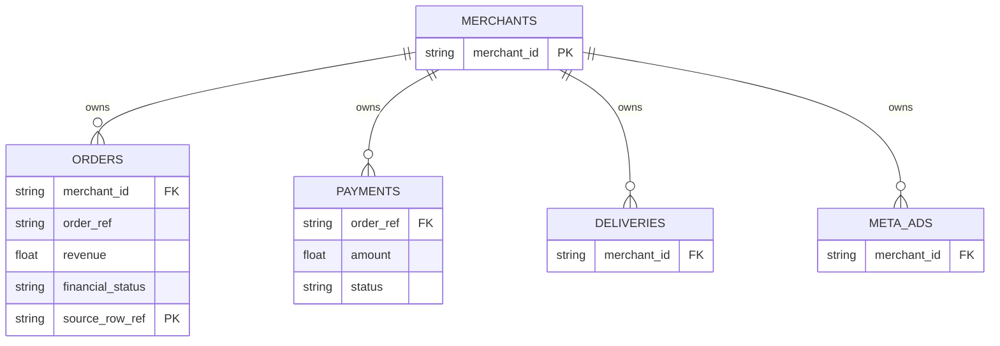

# D2C AI Employee

A centralized AI employee for D2C brands. It continuously monitors data across Shopify (Orders), Razorpay (Payments), Shiprocket (Logistics), and Meta Ads (Marketing) to detect anomalies and find hidden margin leaks.

Instead of running on "vibes" and spending hours stitching Excel sheets, founders get an autonomous agent that flags issues like high RTO rates in specific courier zones or uncollected payment gaps, complete with row-level data citations.

***

## 1. Architecture & Design

I wanted a system that was robust enough to handle the core D2C data loop, but lightweight enough to run autonomously without blowing up LLM costs.

```mermaid
graph TD
    subgraph SaaS Sources
        S[Shopify API] 
        R[Razorpay API]
        SR[Shiprocket Mock]
        M[Meta Ads Mock]
    end

    subgraph Backend - FastAPI
        C[Connectors]
        S --> C
        R --> C
        SR --> C
        M --> C
        
        SJ[Sync Job - Batched Upserts]
        C --> SJ
        
        AE[Agent Engine]
        SJ --> AE
        
        MCP[FastMCP Server]
    end

    subgraph Database - Supabase
        DB[(PostgreSQL)]
        SJ -->|Denormalized Rows| DB
        DB -->|Metric Scan| AE
        DB -->|Tool Queries| MCP
    end

    subgraph Frontend
        UI[React + Tambo AI]
        UI <-->|Tool Execution| MCP
        AE -->|Alerts| UI
    end

    %% Agent Flow
    subgraph Autonomous Loop
        direction TB
        SCAN[Python Metric Scan] -->|Threshold Breached?| LLM[GPT-4o-mini]
        LLM -->|Validate Output| SAVE[Store in DB]
    end
    AE -.-> Autonomous Loop
```

***

## 2. Connectors: Which 3 and Why?

The requirement asked for at least 3 connectors. I chose 4 because D2C margins are lost in the gaps *between* systems.

**The Real Integrations:**
1. **Shopify:** The absolute source of truth for what was sold. (Real REST API)
2. **Razorpay:** The source of truth for what was actually collected. (Real Python SDK)

**The Mocked Integrations:**
3. **Shiprocket (Logistics):** Mocked via deterministic generation. Getting a real Shiprocket API key requires a merchant-level OAuth approval process which I don't have access to for this demo.
4. **Meta Ads (Marketing):** Mocked deterministically. Requires a Meta App Review for the Marketing API.

*Why these specific four?*
The combination of these four dimensions is how you calculate true profitability. If Shopify says an order is placed, but Razorpay says the payment failed, that's a leak. If the order is paid, but Shiprocket RTOs (Returns to Origin) it, you lose the shipping cost. If Meta Ads acquired the customer at an unsustainable CAC, the whole loop is unprofitable.

***

## 3. The Schema: Why this shape?



I used flat, denormalized tables for each domain (`orders`, `payments`, `deliveries`, `meta_ads`).
- **`source_row_ref`:** This is the most important column in the database. It acts as an idempotent conflict key for upserts, and more importantly, it is the **citation anchor**.
- **Join-ability:** The `orders` table is linked to `payments` and `deliveries` via the `order_ref`. This allows the agent to compute exact settlement gaps.
- **Tenant Isolation:** Every table has a `merchant_id` tied to strict Row Level Security (RLS) policies in PostgreSQL.

***

## 4. The Chat Layer & Citations

The chat interface is powered by Tambo AI, which calls into my FastMCP server exposing 8 dedicated tools.

**How Citations Work:**
Whenever a tool runs (like `get_delivery_stats`), it doesn't just return an aggregate number. It returns the data payload alongside a `citations[]` array mapping every aggregated stat back to its specific `source_row_ref`.

When the LLM formulates its response, it has the explicit mapping in its context window. Furthermore, in the agent layer, I built a `_validate_recommendations` function. If the LLM tries to hallucinate a metric value that doesn't exactly match the DB's computed value, the recommendation is silently dropped.

***

## 5. The Agent: What it does & Why

The agent is an **autonomous profitability drain detector**. It watches 6 core metrics (like RTO rate > 15%, or ROAS < 2.0).

**The Two-Phase Architecture:**
I intentionally avoided feeding every row to an LLM.
1. **Phase 1 (Python Scan):** A fast, O(1) SQL aggregation runs to compute the 6 metrics against the merchant's thresholds.
2. **Phase 2 (LLM Validation):** *Only* if a threshold is breached, the LLM is called. It is fed the broken metrics and asked to formulate a plain-English recommendation (e.g., "Shift BlueDart Zone 5-6 orders to Delhivery to save ₹42,000/mo").

*Why this approach?* Because RTO rate and ROAS degradation are the silent killers of Indian D2C brands. The two-phase approach means this can scale to 10,000 merchants without racking up a massive OpenAI bill on merchants who have healthy metrics.

***

## 6. Scale: 1 to 10,000 Merchants

Currently, the sync process runs sequentially and upserts in batches of 50. It's scheduled via `pg_cron` in Supabase.

**What breaks at 10,000 merchants?**
1. **Sync Concurrency:** Sequential HTTP syncs will completely stall. Shopify rate limits to 2 req/s.
   *How to absorb it:* I'd replace the `pg_cron` HTTP calls with a proper message queue (like Celery + Redis or BullMQ) to distribute sync jobs across a pool of workers with tenant-aware rate limiters.
2. **DB Scans:** With 10,000 merchants generating hundreds of orders a day, the `orders` table will hit millions of rows.
   *How to absorb it:* I would need to add composite indexes `(merchant_id, order_date DESC)` to prevent full table scans during the agent's metric aggregation.
3. **Database Connections:** 10,000 concurrent sync jobs will exhaust Supabase's direct connection pool limit.
   *How to absorb it:* I am currently using httpx for Supabase interaction, so we are bypassing the TCP connection limit by using their REST API, which scales much better for this specific bottleneck.

***

## 7. Eval: Where does it break today?

- **Real-time Syncing:** It currently relies on pulling data. If a merchant has 10,000 orders, the pagination works but blocks the event loop for a while. Moving to Webhooks (Shopify `orders/create`) would be vastly superior.
- **Missing API Keys:** If a merchant enters invalid credentials, the sync fails silently rather than alerting the user in the UI.
- **ROAS Calculation:** The mock Meta Ads ROAS assumes a proportional attribution model. In reality, tracking exact ROAS requires complex UTM mapping or a Conversions API integration which isn't present here.

***

## 8. Development Logs

**Hours spent:** ~35 hours over the course of roughly 6 days.
- **Day 1-2:** Schema design, Supabase auth/RLS, and building the real Shopify/Razorpay connectors.
- **Day 3-4:** Agent engine architecture (the two-phase scan), threshold math, and the LLM anti-hallucination validation layer.
- **Day 5-6:** FastMCP tools, Tambo frontend integration, debugging async loops, and documentation.

**A Note on AI Tools:**
I used AI (Claude) heavily for boilerplate generation. It wrote almost all of the FastAPI route signatures, Pydantic schemas, React UI components, and the Supabase SQL policies based on my prompts.
However, the core architectural decisions—the `source_row_ref` citation design, the two-phase agent logic, the anti-hallucination validation, and the connector normalization patterns—were designed and implemented by me.

***

## 9. What I'd do with another week

1. Replace the Shiprocket mock with an actual live integration (requires setting up the OAuth app).
2. Wire up a proper Redis queue for the sync jobs so they run in the background instead of blocking HTTP requests.
3. Hook the MCP server directly into the Tambo chat interface (currently the frontend relies primarily on the FastAPI routes).
4. Build inline citation chips in the React UI so users can click a number and see the exact JSON row from the database that generated it.
